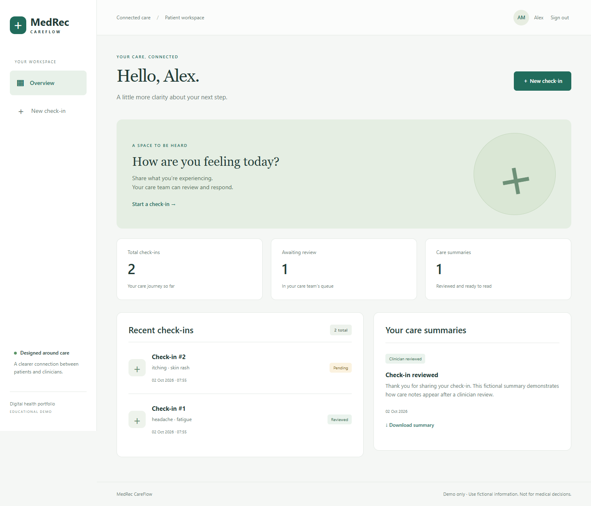
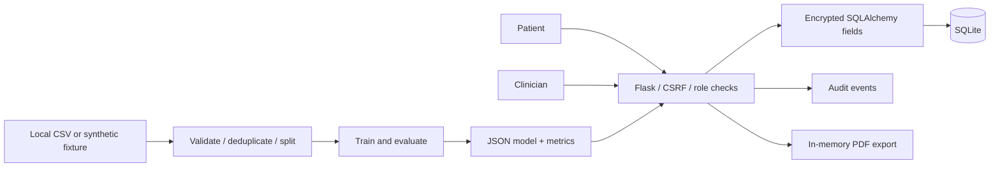

# MedRec CareFlow

A digital-health engineering portfolio: patient check-ins, clinician review, encrypted records, and a reproducible ETL/ML pipeline.

**Educational demonstration. Use fictional information only.** This is not a medical device, diagnostic service, prescribing system, or compliance-certified product.



## What it demonstrates

- **Healthcare workflow:** patients submit symptoms; clinicians independently assess submissions and share downloadable care summaries.
- **Security engineering:** authenticated field encryption, password hashing, CSRF protection, role checks, record ownership checks, login throttling, security headers, and transactional audit events.
- **Data engineering:** schema checks, binary-feature validation, conflicting-label detection, duplicate removal, deterministic splitting, and dataset fingerprinting.
- **Machine learning:** logistic regression benchmarked against a dummy baseline, macro F1, accuracy, confusion matrix, and transparent limitations. JSON inference artifacts avoid pickle deserialization.
- **Software delivery:** responsive Flask application, integration tests, GitHub Actions, dependency auditing, Docker, and automated container delivery to GHCR.

## Run locally

Python 3.10–3.12 is tested by the CI matrix. Commands work in PowerShell or a terminal; activate the environment using the command for your OS.

```sh
python -m venv .venv
# Windows PowerShell: .venv/Scripts/Activate.ps1
# macOS/Linux: source .venv/bin/activate
python -m pip install -r requirements-dev.txt
python scripts/create_fixture.py
python -m ml.train
python -m flask --app app:create_app init-db
python -m flask --app app:create_app create-doctor
python run.py
```

Open http://127.0.0.1:5000, create a fictional patient account, and submit a check-in. Sign out and sign in with the clinician account to review it. Switch back to the patient to download the summary. There are no published default passwords. The clinician CLI asks for a password without echoing it.

Local development generates persistent keys and a SQLite database under ignored `instance/`. Keep these keys to continue reading your local records. Never upload this folder. `.env.example` documents configuration; the Flask CLI loads `.env`, while other entry points require environment variables to be set by the process manager.

## Data and model honesty

The original workspace dataset is preserved locally and excluded from Git because its source and redistribution license are unverified. `scripts/create_fixture.py` creates synthetic, non-clinical labels on a clean clone and refuses to overwrite existing data. A public clone therefore predicts **Synthetic pattern A/B/C**, not medical conditions.

The local original dataset contains 4,920 rows but only 304 unique rows. The deterministic 228/76 split produced accuracy 1.00 and macro F1 1.00, against dummy accuracy 0.0263. These small, template-like data do **not** establish clinical usefulness. Similar patterns can remain across splits even after exact duplicate removal. There is no external validation, subgroup analysis, calibrated risk, or prospective evaluation. See [model card](docs/MODEL_CARD.md).

The published `ml/artifacts/metrics.json` records the original local audit; training replaces it with results for the dataset actually present. Model weights are ignored and regenerated. Restart the application after retraining to reload the cached artifact. Without trained weights, the clinician sees an explicit unavailable-model message.

Deep learning is deliberately not included: the small tabular dataset does not justify it. A future clinical model requires a licensed dataset, expert-defined intended use, external evaluation, and appropriate governance.

## Architecture



All provisioned clinicians share a single demo care-team queue. A production system would need organization and patient assignment policies. Audit events are database records, not tamper-proof logs. Emails and record metadata remain plaintext; clinical text and names use Fernet authenticated encryption. Keys must be managed separately in production. See [security design](docs/SECURITY.md).

## Quality checks

```sh
python -m ruff check .
python -m ruff format --check .
python -m pytest -q
python -m pip_audit -r requirements.txt
```

Tests cover the complete review/download lifecycle, horizontal access control, role escalation, encrypted storage, CSRF, invalid inputs, duplicate review prevention, and output escaping.

## Containers and CI/CD

```sh
docker build -t medrec-careflow .
docker volume create medrec-instance
docker run --rm -v medrec-instance:/app/instance medrec-careflow python -m flask --app app:create_app init-db
docker run --rm -it -v medrec-instance:/app/instance medrec-careflow python -m flask --app app:create_app create-doctor
docker run --rm -p 127.0.0.1:5000:5000 -v medrec-instance:/app/instance medrec-careflow
```

The container runs as a non-root user and uses synthetic data. Docker-created volumes inherit the image directory ownership. Host bind mounts need write permissions for that user. The default commands are for a local demo only.

GitHub Actions runs lint, formatting, tests, training, and a dependency audit on Python 3.10/3.11/3.12. After successful verification on a push, it publishes a commit-tagged image to GitHub Container Registry. This is continuous delivery of a container, not automatic deployment of a public patient service. GitHub package publishing must be enabled for the repository.

For a deployment, set `APP_ENV=production`, supply independent `SECRET_KEY` and `ENCRYPTION_KEY`, terminate HTTPS at a trusted reverse proxy, and use shared rate-limit storage for multiple workers. The current single-process in-memory limiter is a demo default. Do not connect an old plaintext database: this schema requires a fresh database or an explicitly reviewed migration. `init-db` creates missing tables; it does not migrate existing tables.

## Project layout

```text
app.py                  Factory, extensions, security headers and CLI
routes/                 Authentication, patient and clinician workflows
models/models.py        Encrypted data types, records and audit events
ml/train.py             ETL, training and evaluation
ml/ml_model.py          JSON inference and feature contract
scripts/create_fixture.py  Public synthetic demo fixture
static/ + templates/    Responsive user interface
tests/                  Security and workflow tests
.github/workflows/      Verification and container delivery
```

## Engineering references

Security choices follow [Flask security guidance](https://flask.palletsprojects.com/en/stable/web-security/). Evaluation design is informed by [scikit-learn guidance on data leakage](https://scikit-learn.org/stable/common_pitfalls.html). Encryption uses the [cryptography Fernet API](https://cryptography.io/en/latest/fernet/).

Created as a healthcare software, data engineering, and applied ML portfolio project.
